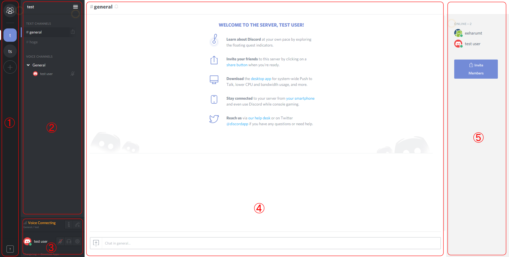

## 基本操作 ##
### 基本画面(Basic-window) ###


1. **サーバー／DMエリア** <br>
  サーバーへの参加、およびサーバーの作成
2. **チャンネルエリア** <br>
  チャンネルへの参加及びチャンネル、サーバ設定など
3. **ユーザー設定エリア** <br>
  ボイス設定、ユーザー設定など
4. **テキストチャットエリア** <br>
  テキストチャットの閲覧、投稿)  
5. **サーバーメンバーエリア** <br>
  サーバーメンバー一覧


### サーバへの参加(Join-server) ###
サーバへ参加するには以下のような招待コードが必要になる。招待コードはURL形式担っているものと文字列担っている物がある。  
```   
https://discord.gg/hogehoge  
hogehoge
```  
招待コードを受け取ったら、サーバー／DMエリアの＋ボタンをクリックして"Join a Server"へ進み、受け取ったコードを入力するとサーバーへ参加することができる。また、招待コードがURL形式の場合、クリックすることでWebブラウザ版でサーバーに参加することもできる。


### チャンネルへの参加(Join-channel) ###
チャンネルへ参加したいときはテキストチャンネル、ボイスチャンネル共にチャンネル名を  **ワンクリック** すればチャンネルに参加できる。

 >_**チャンネルについて**_<br>
 Discord のチャンネルにはテキストチャンネルとボイスチャンネルがあり、これら2つのチャンネルは独立している。(Teamspeak,Skypeとは異なる) よって、ボイスチャンネルを移動しなくても違うテキストチャンネル見ることや、チャットすることができる。


### チャットの使い方(Edit-chat) ###
Discord のチャットにはテキストの装飾、画像・動画ファイルの埋め込みや、Webサイトリンク先情報の表示などといった機能がある。
#### テキストの装飾(Decoration) ####
Discordのチャットの装飾記法はMarkdown記法が用いられている。
* *斜体* = `*斜体*`
* **太字** = `**太字**`
* ***太字＋斜体*** = `***斜体+斜体***`
* <s>打ち消し</s> = `~~斜体~~`
* <u>下線</u> = `__下線__`
* <u>*下線＋斜体*</u> = `__*下線＋斜体*__`
* <u>**下線＋太字**</u> = `__**下線＋太字**__`
* <u>***下線＋太字+斜体***</u> = `__***下線＋太字+斜体***__`
* `コードブロック` = `` `コードブロック` ``
  ```
  複数行
  コード
  ブロック
  ```
  ↓
  ````
  ```
  複数行
  コード
  ブロック
  ```
  ````

### サーバーから退出する ###
サーバーから退出するには、チャンネルエリアの一番上にあるサーバー名をクリックし"Leave Server"をおすと退出できる。<br>
**サーバーから退出するともう一度、招待コードを入力しない限りサーバーへ参加できません。**

### サーバーのたてかた(Create-server) ###
サーバーをたてるには参加と同じく＋ボタンから行うことができる。"Create Server"を選択すると

  * サーバー名  
  * サーバーの設置場所  
  * サーバーのアイコン  

をそれぞれ設定できる。設定後"Create"を押すことでサーバーをたてる事ができる。


